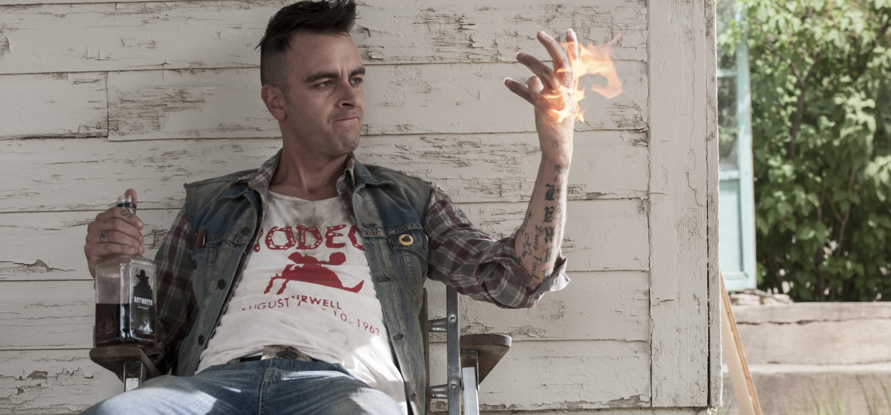
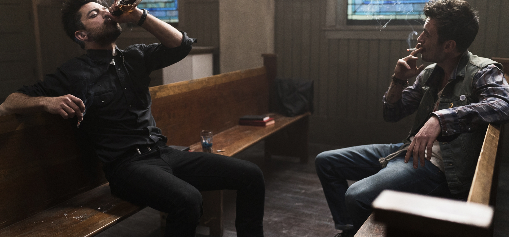
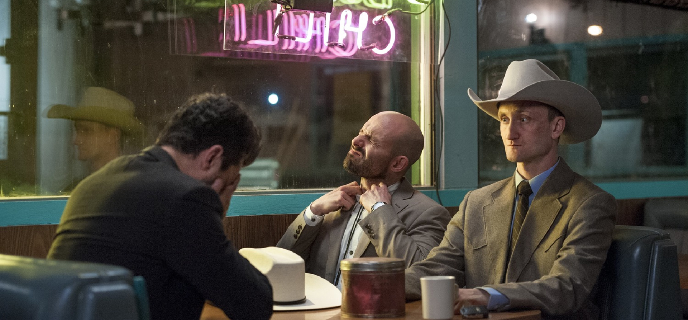

<!DOCTYPE html>
<html lang="en">
<head>
   <meta charset="UTF-8">
   <meta http-equiv="X-UA-Compatible" content="IE=edge">
   <meta name="viewport" content="width=device-width, initial-scale=1.0">
   <link rel="stylesheet" href="css/style.css">
   <link rel="stylesheet" href="css/media.css">
   <title>Self 9</title>
</head>
<body>
   

      

         

            

               

                  <nav class="nav">
                     

                        <a>Preacher</a>
                     

                     

                        
                     

                     <ul class="ul" id="ul">
                        <li class="li1"><a class="link_head" href="#series1">1 series</a></li>
                        <li class="li1"><a class="link_head" href="#series2">2 series</a></li>
                        <li class="li1"><a class="link_head" href="#series3">3 series</a></li>
                        <li class="li1"><a class="link_head" href="#series4">4 series</a></li>
                        <li class="li1"><a class="link_head" href="#series5">5 series</a></li>
                     </ul>
                  </nav>
               

            

         

         

            

               

                  

                     

                        
                     

                     

                        
                     

                     

                        

                           Сериал, который с трудом можно досмотреть
                           только до пятой серии.
                        

                     

                  

               

            

         

      

      

         

            

               

                  <a href="series1.html" class="page1_link_series page1_link_series2 title">
                     1 series
                  </a>
               

               

                  

                     
                  

                  

                     
                  

                  

                     

                        Начало сериала предпологает интересный сюжет с колоритными 
                        персонажами и неожиданным появлением нового персонажа Кэссиди. 
                     

                  

               

            

         

      

      

         

            

               

                  <a href="series2.html" class="page1_link_series page1_link_series2 title">
                     2 series
                  </a>
               

               

                  

                     
                  

                  

                     
                  

                  

                     

                        Вторая серия преподносит нам  большое раскрытие нового персонажа Кэссиди, 
                        с дополнением новой героини на которую в принципе будет пох.й в дальнейшем 
                     

                  

               

            

         

      

      

         

            

               

                  <a href="series3.html" class="page1_link_series page1_link_series2 title">
                     3 series
                  </a>
               

               

                  

                     
                  

                  

                     
                  

                  

                     

                        Третью серию не помню, но вроде бы была сцена близкого 
                        общения скучного (как оказалось проповедника) и Кэссиди.
                     

                  

               

            

         

      

      

         

            

               

                  <a href="series4.html" class="page1_link_series page1_link_series2 title">
                     4 series
                  </a>
               

               

                  

                     
                  

                  

                     
                  

                  

                     

                        В четвёртой серии нерешительность проведника, которого похер как зовут, 
                        Кэссиди и ангелы (ПОЛНЫЙ БРЕД).
                     

                  

               

            

         

      

      

         

            

               

                  <a href="series5.html" class="page1_link_series page1_link_series2 title">
                     5 series
                  </a>
               

               

                  

                     
                  

                  

                     
                  

                  

                     

                        На этой серии в принципе можно остановиться и даже не раскрывшаяся 
                        изюминка сериала совсем не интересна.
                     

                  

               

            

         

      

      <footer class="footer">
         

            

               

                  Это не ссылки, а просто картинки
               

               

                  
                  
                  
                  
               

            

         

      </footer>
   

   
   
   
</body>
</html>
